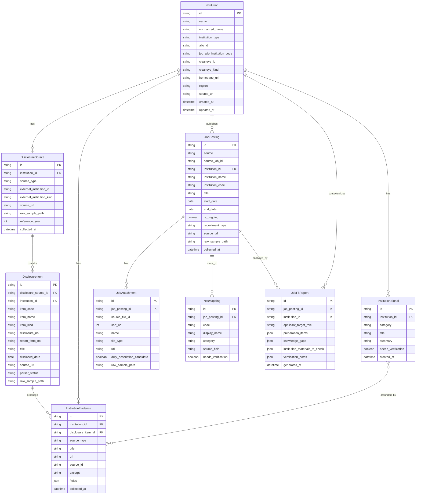

# ERD v0

작성일: 2026-07-07 KST

## 현재 진행 상태

이 ERD는 raw sample 수집과 필드 인벤토리 이후, 실제 MCP tool 구현 전에 맞추는
정규화 데이터 모델 초안이다. DB migration이나 영속 저장소 구현을 바로 의미하지 않는다.

완료된 범위:

- Job-ALIO 채용공고 검색/상세 client와 collector가 있다.
- Job-ALIO 공고, 첨부파일, 전형 단계, NCS 코드/표시명을 Pydantic schema로 정규화한다.
- ALIO 경영공시는 기관 검색/상세, 항목별 보고서 목록, 첨부파일, HTML raw sample 수집이 가능하다.
- ALIO 검증 대상 항목은 `6-2`, `40`, `47-1`, `49-1`, `49-2`, `50-1`, `50-2`다.
- ALIO `47-2` 감사원 지적사항과 `47-3` 주무부처 지적사항은 현재 수집 범위에서 제외한다.
- Cleaneye는 지방공기업 `entId`와 지방출자출연 `insttCode`를 분리해 검색, 항목 metadata, HTML raw sample을 수집한다.
- `NcsMappingInput`, `InstitutionAnalysisInput`, `JobFitPreparationReport` helper schema가 있다.

아직 남은 범위:

- 실제 MCP tool registry에는 `health_check`만 등록되어 있다.
- ALIO/Cleaneye HTML table을 필드 단위로 해석하는 parser는 아직 없다.
- Job-ALIO, ALIO, Cleaneye 기관 식별자를 하나의 기관으로 확정 매칭하는 규칙은 아직 초안 단계다.
- ERD 기반 저장소, migration, repository layer는 아직 없다.

## ERD 범위

v0는 다음 흐름을 지원하는 데 필요한 최소 엔티티만 둔다.

1. `search_public_jobs`
2. `lookup_region_codes`
3. `fetch_job_detail`
4. `collect_institution_context`
5. `analyze_job_fit_report`

raw sample은 `data/raw_samples`에 계속 보존하고, ERD의 테이블은 분석과 MCP 응답에 쓰는
정규화된 레이어로 본다. raw payload 전체를 테이블 컬럼으로 옮기지 않고, 필요한 경우
`raw_sample_path` 또는 `raw_ref`로 연결한다.

## 파싱 가능한 필드와 보류 필드

### 바로 파싱 가능한 필드

| 영역 | 필드 |
| --- | --- |
| Job-ALIO 공고 | 공고 ID, 기관명, Job-ALIO 기관 코드, 제목, 공고 시작일, 마감일, 진행 여부, 채용 구분, 고용 유형, 근무 지역, 채용 인원, 원문 URL |
| Job-ALIO 상세 | 지원자격, 우대조건, 가점/우대사항, 결격사유, 전형절차, 첨부파일 metadata, 전형 단계 metadata |
| NCS | NCS 코드와 표시명 index 기반 매핑 |
| ALIO 기관 | `apbaId`, 기관명, 기관 유형, 주무부처, 홈페이지, 소재지, 주요사업 요약, 원문 URL |
| ALIO 공시 목록 | 항목번호, 내부 보고서 번호, 공시 번호, 제목, 공시일, 제출번호, 원문 URL |
| ALIO 첨부파일 | 파일 번호, 원본 파일명, 저장명, 파일 유형, 파일 크기, 다운로드 후보 URL |
| Cleaneye 기관 | `entId` 또는 `insttCode`, 기관명, 기관 구분, 기관 유형 코드, 원문 URL |
| Cleaneye 항목 | itemNo, itemId, 항목명, action URL, 사용 여부 |

### 보류할 필드

| 영역 | 보류 이유 |
| --- | --- |
| ALIO 수시 게시판 상세 HTML row | 항목별 HTML 구조가 다르므로 table parser 설계 후 승격한다. |
| ALIO 정기 보고서 본문 table | `itemReportRight.do` 본문과 첨부 PDF 구조가 항목별로 다르다. |
| ALIO `7030x` 수의계약 세부 보고서 | 여러 세부 보고서가 묶여 내려오므로 item code 확장 규칙이 필요하다. |
| Cleaneye 일반현황/경영평가/부채/사업보고서 본문 table | 지방공기업과 출자출연기관의 화면과 기준연도가 다르므로 parser를 분리 검증해야 한다. |
| Cleaneye 첨부파일 URL | 이번 조사 범위에서는 안정 endpoint로 확정하지 않았다. |
| 직무기술서 본문 K/S/A | PDF/HWP/HWPX/ZIP 텍스트 추출기가 붙기 전까지 확정하지 않는다. |
| 기관 간 자동 매칭 | 기관명만으로 합치지 않고 source별 ID와 근거를 모은 뒤 검증한다. |

## Mermaid ERD

## 엔티티 정의

### Institution

기관의 canonical record다. ALIO, Job-ALIO, Cleaneye 식별자는 같은 의미로 강제 병합하지 않고
nullable 필드로 보존한다.

v0에서는 단순성을 위해 `alio_id`, `job_alio_institution_code`, `cleaneye_id`,
`cleaneye_kind`를 `Institution`에 둔다. 이후 한 기관이 여러 source ID를 갖는 사례가 늘면
`InstitutionIdentifier`로 분리한다.

핵심 제약:

- `normalized_name`은 공백 정리 수준으로만 만든다.
- 공사/공단/병원 같은 법적 접미사를 임의 제거하지 않는다.
- 기관명만으로 source ID를 자동 확정하지 않는다.

### JobPosting

Job-ALIO 공고 검색과 상세의 중심 엔티티다.

`source_job_id`는 Job-ALIO `recrutPblntSn`을 보존한다. `institution_id`는 기관 매칭이
확정되기 전까지 nullable이다. MCP 응답에서는 `institution_name`과 `institution_code`를
항상 함께 반환해 사용자가 원천 표기를 확인할 수 있게 한다.

v0 필수 후보:

- `source`, `source_job_id`
- `institution_name`, `institution_code`
- `title`
- `start_date`, `end_date`, `is_ongoing`
- `source_url`

### JobAttachment

공고 첨부파일 metadata다. 직무기술서 본문 파싱 전에도 파일명, 파일 유형, URL은 보존한다.

`duty_description_candidate`는 다음 기준 중 하나를 만족하면 true 후보로 둔다.

- `file_type == "C"`
- 파일명에 `직무기술서`, `직무설명`, `NCS`가 포함된다.

본문 텍스트는 이 엔티티에 직접 넣지 않고, 별도 추출기가 붙으면 raw sample 또는 evidence로 연결한다.

### NcsMapping

공고와 NCS 코드/표시명을 연결한다. 현재는 Job-ALIO의 `ncsCdLst`와 `ncsCdNmLst` index 매핑이
가장 안정적인 근거다.

길이가 맞지 않거나 표시명이 누락되면 임의 보정하지 않고 `needs_verification=true`로 둔다.
K/S/A 후보까지 저장해야 하는 시점에는 `category`를 `knowledge`, `skill`, `attitude`,
`basic_competency`, `duty_competency`로 확장할 수 있다.

### DisclosureSource

기관 공시 수집의 run/source 단위다. ALIO와 Cleaneye는 대상 기관군과 ID 체계가 다르므로
`source_type`, `external_institution_id`, `external_institution_kind`를 함께 보존한다.

예시:

- ALIO: `source_type=alio_disclosure`, `external_institution_id=C0399`
- Cleaneye 지방공기업: `source_type=cleaneye`, `external_institution_id=2017000008`, `external_institution_kind=local_public_enterprise`
- Cleaneye 출자출연: `source_type=cleaneye`, `external_institution_id=B000261`, `external_institution_kind=local_invested_contributed`

### DisclosureItem

공시 항목 또는 보고서 row다. ALIO의 항목별 보고서와 Cleaneye의 item metadata/본문을 같은
테이블에 담되, source별 코드를 그대로 둔다.

`parser_status` 값:

- `raw_only`: raw HTML 또는 metadata만 있음
- `metadata_parsed`: 목록/metadata 수준은 정규화됨
- `table_parsed`: HTML table에서 필드 단위 값이 추출됨
- `blocked`: 구조가 불안정하거나 수집 범위 밖임

현재 ALIO/Cleaneye 대부분의 HTML 본문은 `raw_only` 또는 `metadata_parsed`로 시작한다.

### InstitutionEvidence

기관 분석에 쓸 수 있는 원문 근거다. `DisclosureItem`에서 나온 excerpt, ALIO 기관 상세의
`contents`, Cleaneye 본문 일부, 기관 홈페이지 문장 등을 보관한다.

원칙:

- evidence 없는 signal은 최종 주장으로 쓰지 않는다.
- excerpt는 사람이 원문과 대조 가능한 길이로만 둔다.
- source별 원본 필드는 `fields` JSON에 보존한다.

### InstitutionSignal

기관 사업 방향, 개선 과제, 직무 연결 후보를 담는다.

category 후보:

- `business_direction`
- `improvement_task`
- `job_connection`
- `financial_or_operational`
- `management_evaluation`

`InstitutionSignal`과 `InstitutionEvidence`는 다대다 관계가 가능하다. 물리 DB를 만들 때는
`InstitutionSignalEvidence` bridge table을 둔다.

### JobFitReport

공고, NCS, 기관 signal, 지원자 준비 상태를 연결한 최종 리포트 metadata다.

v0에서는 준비 항목을 자주 쿼리할 가능성이 낮으므로 `preparation_items`, `knowledge_gaps`,
`institution_materials_to_check`, `verification_notes`를 JSON으로 둔다. 나중에 준비 항목별
검색이나 상태 관리가 필요하면 `JobFitReportItem`으로 분리한다.

## Tool별 사용 모델

| tool | 읽기 | 쓰기 또는 갱신 |
| --- | --- | --- |
| `lookup_region_codes` | Job-ALIO `workRgnLst` 코드 테이블 | 없음 |
| `search_public_jobs` | Job-ALIO list raw, `Institution` 후보 | `JobPosting`, 기본 `NcsMapping` 후보 |
| `fetch_job_detail` | Job-ALIO detail raw | `JobPosting`, `JobAttachment`, `NcsMapping` |
| `collect_institution_context` | ALIO/Cleaneye raw, 기관 홈페이지 후보 | `Institution`, `DisclosureSource`, `DisclosureItem`, `InstitutionEvidence`, `InstitutionSignal` |
| `analyze_job_fit_report` | `JobPosting`, `JobAttachment`, `NcsMapping`, `InstitutionSignal`, `InstitutionEvidence` | `JobFitReport` |

## 다음 구현 순서

1. `docs/erd.md` 기준으로 MCP 응답 schema 이름을 정리한다.
2. `search_public_jobs`를 먼저 구현한다. 이 단계에서는 `JobPosting` 목록과 NCS 코드 후보만 반환한다.
3. `fetch_job_detail`에서 첨부파일과 상세 필드를 붙인다.
4. ALIO/Cleaneye HTML table parser는 `DisclosureItem.parser_status=raw_only`인 항목을 줄이는 작업으로 분리한다.
5. `collect_institution_context`에서 evidence와 signal 후보를 만든다.
6. `analyze_job_fit_report`는 evidence가 연결된 signal만 사용한다.

## 보류 결정

| 결정 | 이유 |
| --- | --- |
| `InstitutionIdentifier` 분리 | v0에서는 source ID가 세 개뿐이라 `Institution` nullable 필드가 더 단순하다. |
| `JobFitReportItem` 분리 | 현재 helper 출력이 JSON 구조이고, 항목별 DB 쿼리 요구가 아직 없다. |
| ALIO/Cleaneye 공통 table parser 확정 | HTML 구조가 충분히 안정화되지 않았다. 먼저 source별 parser를 얇게 만들고 공통화 가능성을 판단한다. |
| 첨부파일 본문 저장 | PDF/HWP/HWPX/ZIP 추출 정책과 파일 저장 정책이 아직 없다. |
