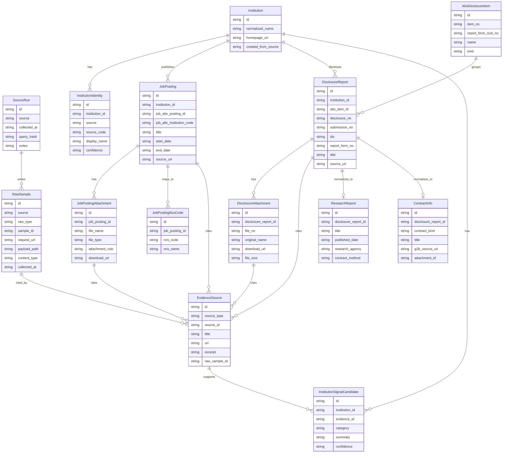

# Source Data ERD v0

작성일: 2026-07-07 KST

## 목적

Job-ALIO 채용공고와 ALIO 경영공시 raw sample을 기준으로 parser 구현 전 협업 가능한 ERD v0를
정의한다. 이 문서는 원천 JSON/HTML 저장 계층과 분석용 정규화 계층을 분리하고, collector와
parser가 어느 모델을 채워야 하는지 표시한다.

v0 범위는 중앙 공공기관 채용 준비에 필요한 Job-ALIO와 ALIO다. Cleaneye는 지방공공기관 계열로
별도 source identity를 유지하되, 이 문서의 핵심 ERD에는 포함하지 않는다.

## 계층 구분

| 계층 | 목적 | 채우는 주체 | 예시 |
| --- | --- | --- | --- |
| Raw collection | 원본 응답과 요청 조건 보존 | collector | `RawSample`, `SourceRun` |
| Source-normalized | 소스별 안정 필드 정규화 | parser/adapter | `JobPosting`, `DisclosureReport` |
| Analysis bridge | 분석/리포트가 참조할 근거 연결 | parser/analysis adapter | `EvidenceSource`, `InstitutionSignalCandidate` |

원칙:

- raw sample은 절대 분석 테이블로 덮어쓰지 않는다.
- source-normalized 모델은 원본 key와 URL을 되돌아갈 수 있게 `raw_sample_id` 또는 `evidence_id`를 가진다.
- 분석 후보는 신뢰 가능한 근거가 있을 때만 `EvidenceSource`를 통해 연결한다.
- 기관 식별자는 출처별 코드를 유지하고, 이름만으로 병합하지 않는다.

## Mermaid ERD

## 원천 저장 모델

### SourceRun

수집 실행 단위를 기록한다. 동일 collector가 같은 query로 여러 raw sample을 만들 수 있으므로
`RawSample`의 부모 역할을 한다.

| 필드 | 의미 |
| --- | --- |
| `id` | `source`와 timestamp 기반 run id |
| `source` | `job_alio`, `alio_disclosure` |
| `collected_at` | UTC 또는 KST 기준 수집 시각 |
| `query_hash` | 수집 query 재현용 hash |
| `notes` | 수집기 경고, 제외 항목, 샘플링 기준 |

### RawSample

원본 JSON/HTML 저장 테이블이다. payload는 DB JSONB 또는 파일 경로 어느 쪽이든 가능하지만,
v0에서는 현재 `data/raw_samples/...` 구조와 맞춰 `payload_path`로 설명한다.

| 필드 | 의미 |
| --- | --- |
| `id` | raw sample 내부 식별자 |
| `source` | `job_alio`, `alio_disclosure` |
| `raw_type` | `list`, `detail`, `attachment`, `html`, `metadata` |
| `sample_id` | 소스별 사람이 읽을 수 있는 sample key |
| `request_url`, `request_body` | 원본 요청 재현 정보 |
| `payload_path` | raw 파일 위치 또는 object storage key |
| `content_type` | `application/json`, `text/html` |
| `metadata` | normalized_count, item_no, report_form_root_no 등 수집 메타 |

collector는 여기까지만 책임진다. 원본 응답을 해석해서 `JobPosting`, `DisclosureReport`를 채우는
작업은 parser/adapter 단계로 둔다.

## 기관 식별 모델

### Institution

프로젝트 내부의 기관 기준 row다. 처음에는 ALIO 기관 상세 또는 Job-ALIO 공고에서 만들어질 수
있지만, 출처별 코드를 하나의 컬럼에 억지로 합치지 않는다.

| 필드 | 의미 |
| --- | --- |
| `id` | 내부 UUID 또는 deterministic id |
| `normalized_name` | 공백만 정리한 기관명 |
| `homepage_url` | 확인된 공식 홈페이지 |
| `created_from_source` | 최초 생성 출처 |

### InstitutionIdentity

출처별 기관 식별자를 별도 row로 둔다.

| source | source_code | display_name | 비고 |
| --- | --- | --- | --- |
| `alio_disclosure` | `apbaId` | `apbaNa`, `dcsrApbaNa` | 중앙 공공기관 기준 코드 |
| `job_alio` | `pblntInstCd` | `instNm` | 채용공고 게시기관 코드 |
| `job_alio` | `pbadmsStdInstCd` | `instNm` | 행정표준기관 코드 후보 |

매칭 방식:

1. `apbaId`와 Job-ALIO 코드가 직접 같다고 가정하지 않는다.
2. 같은 기관명, 공식 홈페이지, 기관 상세 URL, 행정표준기관 코드 후보를 근거로 매칭 후보를 만든다.
3. 자동 확신이 낮으면 `confidence=needs_review`로 보존한다.
4. 최종 병합은 `InstitutionIdentity`를 추가하는 방식으로 하고 raw row는 수정하지 않는다.

## Job-ALIO 정규화 모델

### JobPosting

Job-ALIO 목록/상세 JSON에서 채운다.

| 필드 | 원본 필드 | 비고 |
| --- | --- | --- |
| `job_alio_posting_id` | `recrutPblntSn` | 공고 상세 key |
| `job_alio_institution_code` | `pblntInstCd` | `InstitutionIdentity` 후보 |
| `title` | `recrutPbancTtl` | 공고 제목 |
| `start_date` | `pbancBgngYmd` | ISO date로 정규화 |
| `end_date` | `pbancEndYmd` | ISO date로 정규화 |
| `source_url` | `srcUrl` | 기관 원문 공고 URL |
| `qualification` | `aplyQlfcCn` | 장문 text |
| `preferred_conditions` | `prefCondCn`, `prefCn` | 장문 text |
| `screening_procedure` | `scrnprcdrMthdExpln` | 장문 text |

### JobPostingAttachment

Job-ALIO 상세의 `files`에서 채운다.

| 필드 | 의미 |
| --- | --- |
| `file_name` | 원본 파일명 |
| `file_type` | 확장자 또는 원본 type |
| `attachment_role` | `announcement`, `job_description`, `application_form`, `other` |
| `download_url` | 첨부 다운로드 후보 URL |

직무기술서는 `attachment_role=job_description`으로 표시하고, NCS/직무 분석의 텍스트 추출 대상이 된다.

### JobPostingNcsCode

Job-ALIO `ncsCdLst`와 `ncsCdNmLst`를 분리 보존한다.

| 필드 | 의미 |
| --- | --- |
| `ncs_code` | NCS 코드 |
| `ncs_name` | NCS 표시명 |
| `position_index` | 원본 comma-separated 순서 |

NCS 연결 지점:

- 공고 단위 직무군 후보는 `JobPostingNcsCode`에서 나온다.
- 직무기술서 attachment에서 추출한 KSA/직무수행능력은 이후 별도 `JobDutyEvidence` 계열로 확장한다.
- 코드와 표시명 개수가 다르면 임의 병합하지 않고 mismatch note를 남긴다.

## ALIO 정규화 모델

### AlioDisclosureItem

수집 대상 공시 항목 메타데이터다.

| 필드 | 예시 | 비고 |
| --- | --- | --- |
| `item_no` | `40`, `49-2` | 사용자에게 보이는 항목번호 |
| `report_form_root_no` | `31501`, `7030`, `B1020` | ALIO 내부 root 번호 |
| `name` | 주요사업, 수의계약 | 항목명 |
| `kind` | `regular`, `occasional` | 정기 보고서와 수시 게시판 구분 |

### DisclosureReport

ALIO 항목별 목록과 상세 HTML/parser 결과를 묶는 핵심 모델이다.

| 필드 | 원본 필드 | 의미 |
| --- | --- | --- |
| `disclosure_no` | `disclosureNo` | 정기 보고서 본문/첨부 조회 key |
| `submission_no` | `submissionNo` | 제출/수정 단위 key |
| `idx` | `idx` | 수시 게시판 상세 row key |
| `idx_name` | `idxName` | `IDX`, `BOARD_NO`, `SUBMISSION_NO` 등 |
| `report_form_no` | `reportFormNo` | 실제 항목 세부 번호 |
| `title` | `title`, `rtitle` | 제목 |
| `source_url` | 조합 URL | 원문 링크 |

`disclosureNo`, `submissionNo`, `idx` 역할:

- `disclosureNo`: 정기 보고서 `itemReportRight.do`, `itemReportFiles.json` 조회의 기본 key다.
- `submissionNo`: 제출 이력/수정본과 파일 저장 경로에 연결되는 key다.
- `idx`: 수시 게시판 상세 조회의 row key다. `B1210`처럼 `disclosureNo`가 `0000000000000000`인 경우
  `idx`와 `submissionNo`를 provenance로 더 신뢰한다.

### DisclosureAttachment

ALIO 정기 보고서 `files` 문자열과 `itemReportFiles.json`을 같은 구조로 정규화한다.

| 필드 | 의미 |
| --- | --- |
| `file_no` | 다운로드 key |
| `original_name` | 표시 파일명 |
| `download_url` | `/download/file.json?f=...&d=...&s=...` |
| `file_size` | `0`도 정상 값으로 보존 |
| `source_kind` | `list_files`, `item_report_files` |

### ResearchReport

ALIO `50-2` 외부용역 연구 보고서에서 승격되는 분석용 모델이다.

| 필드 | 원본 후보 |
| --- | --- |
| `title` | `title`, HTML 제목 |
| `published_date` | 발간일 |
| `registered_date` | 등록일 |
| `research_agency` | 연구기관 |
| `contract_method` | 계약방식 |
| `attachment_id` | PDF/HWP 첨부 |

`50-1` 자체 연구 보고서는 기관별 0건이 가능하므로 빈 목록을 정상 상태로 둔다.

### ContractInfo

ALIO `49-1` 입찰공고와 `49-2` 수의계약에서 승격된다.

| 필드 | 원본 후보 |
| --- | --- |
| `contract_kind` | `bid_notice`, `private_contract` |
| `title` | 입찰/계약 제목 |
| `g2b_source_url` | 나라장터 바로가기 |
| `attachment_id` | 수의계약 XLSX 또는 공고 첨부 |

`49-2` 실제 계약 row는 HTML 본문이 아니라 XLSX 첨부 안에 있으므로, attachment parser 이후에만
계약명/금액/상대자 필드를 확정한다.

## EvidenceSource와 분석 후보

`EvidenceSource`는 분석 결과가 참조할 수 있는 최소 근거 단위다.

| 필드 | 의미 |
| --- | --- |
| `source_type` | `job_alio`, `alio_disclosure`, `job_attachment`, `disclosure_attachment` |
| `source_id` | 원천 모델 id 또는 source-specific key |
| `title` | 근거 제목 |
| `url` | 원문 URL |
| `excerpt` | 분석에 쓴 짧은 원문 일부 |
| `raw_sample_id` | 되돌아갈 raw sample |

`InstitutionSignalCandidate`는 evidence를 바탕으로 만든 분석 후보만 담는다.

| category | 근거 후보 |
| --- | --- |
| `business_direction` | ALIO 주요사업, 사업보고서, 기관 소개 |
| `improvement_task` | 국회지적사항, 감사결과, 조치결과 |
| `job_connection` | 채용공고 제목, 직무기술서, NCS 코드 |
| `financial_or_operational` | 부채, 재무, 수의계약/입찰 자료 |
| `management_evaluation` | 경영평가, 성과 자료 |

## Collector와 parser 책임

| 컴포넌트 | 책임 | 채우는 모델 |
| --- | --- | --- |
| `JobAlioCollector` | 목록/상세 raw JSON 저장 | `SourceRun`, `RawSample` |
| `AlioDisclosureCollector` | 기관/항목/본문/첨부 raw 저장 | `SourceRun`, `RawSample` |
| Job-ALIO parser | 채용공고 안정 필드, 첨부, NCS 코드 정규화 | `JobPosting`, `JobPostingAttachment`, `JobPostingNcsCode` |
| ALIO item parser | 항목별 목록과 HTML/body/table 정규화 | `AlioDisclosureItem`, `DisclosureReport`, `DisclosureAttachment` |
| Analysis adapter | 분석 후보와 근거 연결 | `EvidenceSource`, `InstitutionSignalCandidate` |

## v0 보류 사항

- Job-ALIO 기관 코드와 ALIO `apbaId`의 자동 매칭 rule 확정
- 직무기술서 PDF/HWP 텍스트 추출 후 KSA 세부 엔티티 설계
- ALIO HTML table parser의 column-level schema
- 수의계약 XLSX 내부 row schema
- PRD 이후 실제 DB migration 또는 ORM 모델 반영
